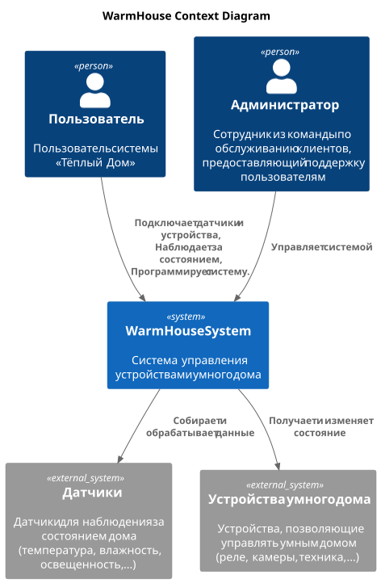
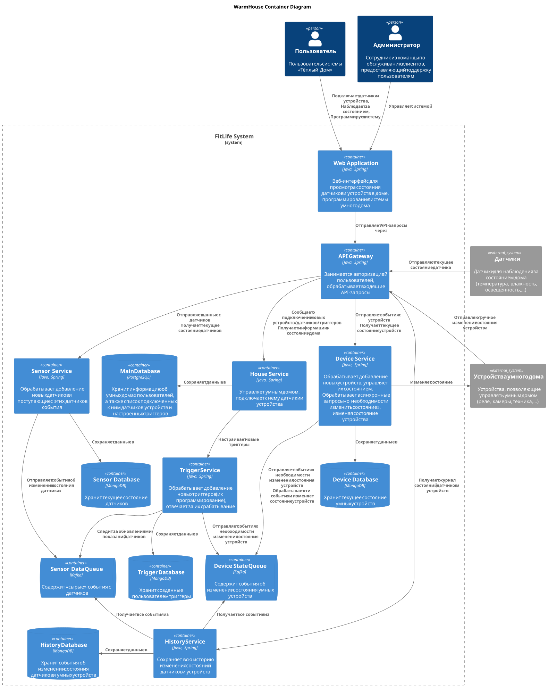
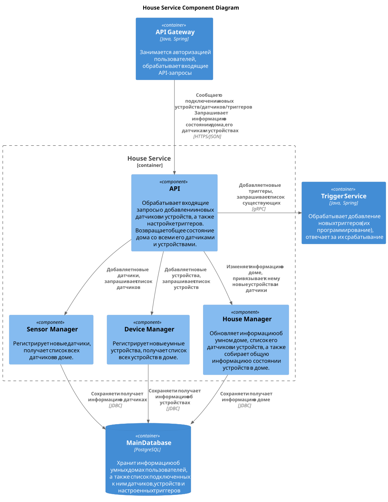
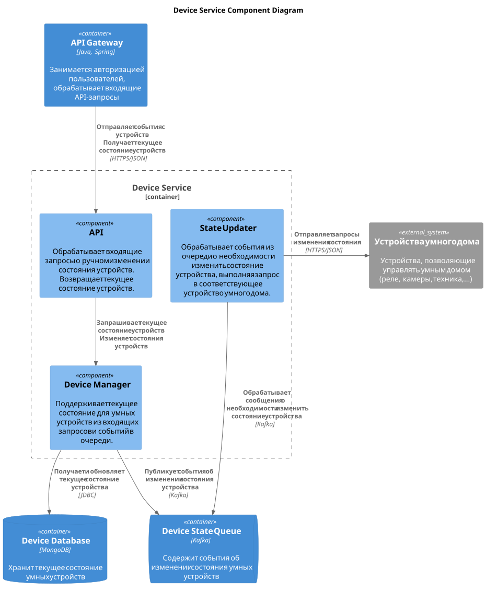
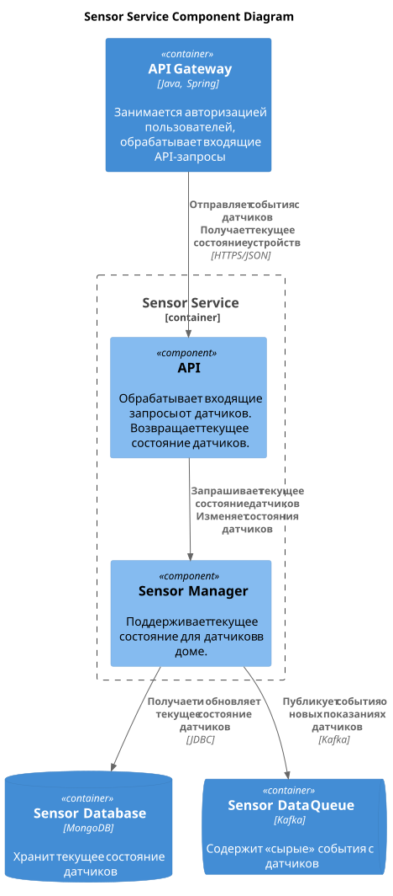
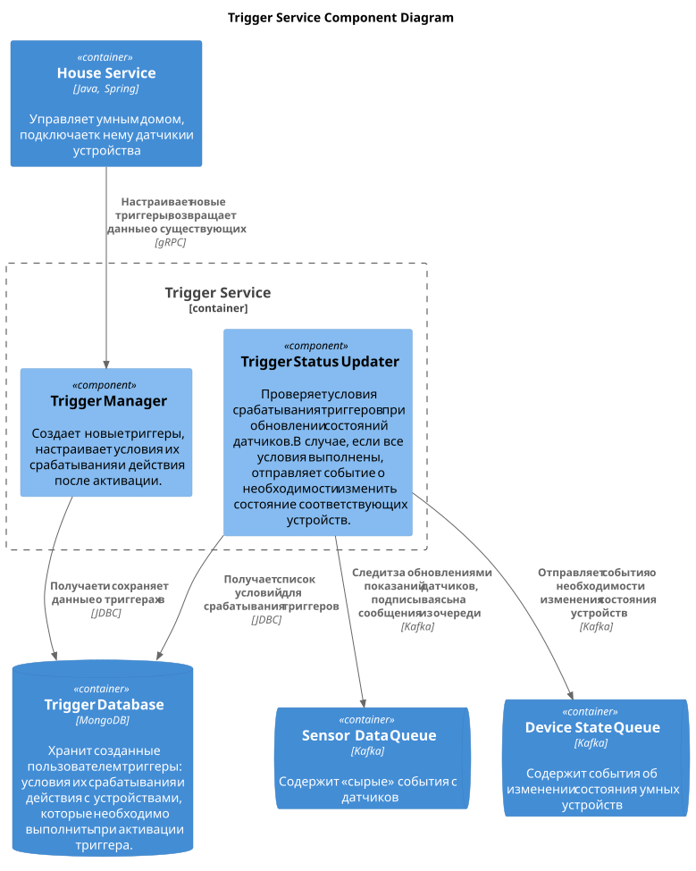
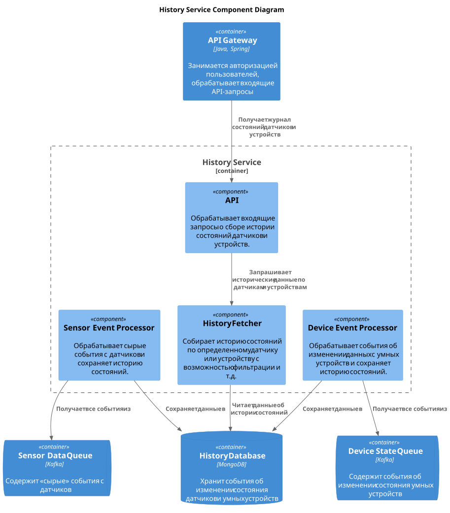
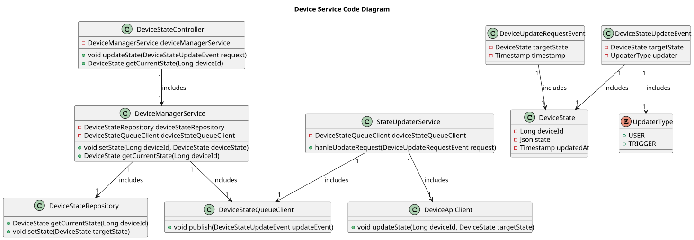
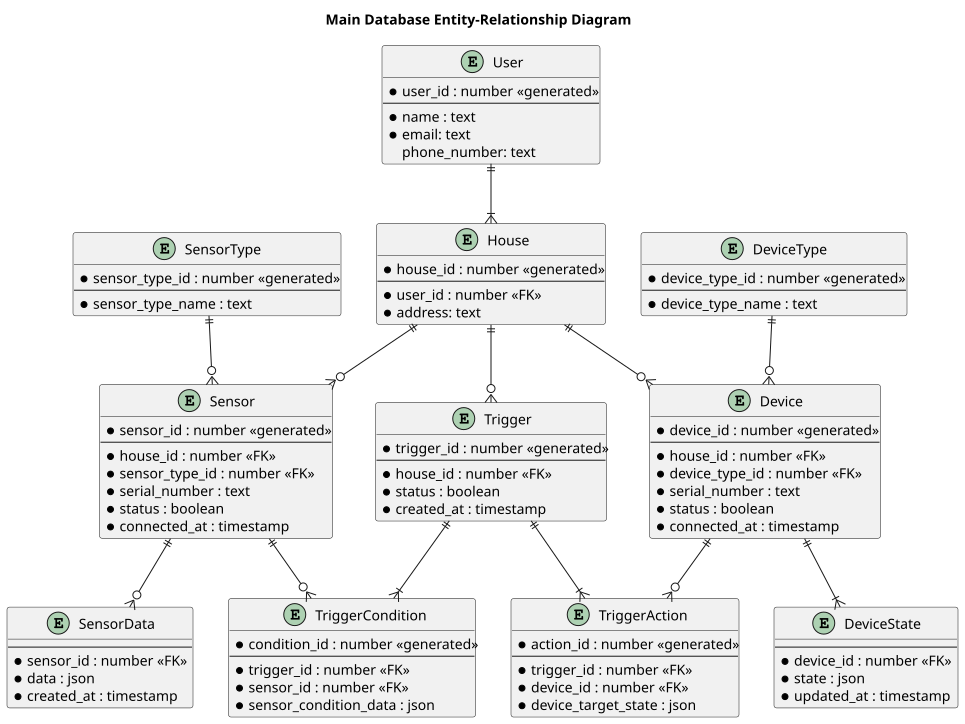

# Project_template

Это шаблон для решения проектной работы. Структура этого файла повторяет структуру заданий. Заполняйте его по мере работы над решением.

# Задание 1. Анализ и планирование

<aside>
💡

Чтобы составить документ с описанием текущей архитектуры приложения, можно часть информации взять из описания компании и условия задания. Это нормально.

</aside>

### 1. Описание функциональности монолитного приложения

**Управление отоплением:**

- Пользователи могут удалённо включать/выключать отопление в своих домах.
- Система поддерживает возможность установить целевое значение температуры в доме.

**Мониторинг температуры:**

- Пользователи могут просматривать текущую температуру в своих домах через веб-интерфейс.
- Система получает данные о температуре с датчиков, установленных в домах.

### 2. Анализ архитектуры монолитного приложения

#### Язык программирования
Java 17, Spring Framework.

#### База данных
PosgtreSQL.

#### Взаимодействие между компонентами
Синхронное, все запросы обрабатываются последовательно.

### 3. Определение доменов и границы контекстов

#### Домен: мониторинг датчиков

* контекст: подключение датчика
* контекст: мониторинг показаний датчика

#### Домен: управление устройствами

* контекст: подключение устройства
* контекст: наблюдение за состоянием устройства
* контекст: удаленное управление устройством

#### Домен: программирование системы

Программирование подразумевает возможность покупателя настраивать определенные
"триггеры" на показания датчиков в их умном доме. Также можно настраивать действия,
которые будут выполняться автоматически при срабатывании триггеров. Действия могут
использовать любые умные устройства, находящиеся в доме.

* контекст: добавление триггеров
* контекст: ведение журнала срабатываний триггера

### **4. Проблемы монолитного решения**

* **Монолит сложно масштабировать по частям.** При увеличении нагрузки на одну часть системы
(например, сбор показаний датчиков), придется масштабировать всю систему целиком.

* **Развертывание требует остановки всего приложения.** С выходом новой версии
приложения, система становится полностью недоступной на некоторое время, что
ухудшает пользовательский опыт.

* **Увеличивается риск критических ошибок.** Добавление новой функциональности
в систему может привести к падению всего сервиса и полной недоступности системы.

* **Трудно масштабировать команду разработки.** С ростом приложения может понадобиться
расширение команды разработчиков, т.к. сейчас в ней всего 5 человек. Работа нескольких
команд над одним монолитом приведет к постоянным конфликтам и задержкам на
синхронизацию действий.

### 5. Визуализация контекста системы — диаграмма С4

# Задание 2. Проектирование микросервисной архитектуры

В этом задании вам нужно предоставить только диаграммы в модели C4. Мы не просим вас отдельно описывать получившиеся микросервисы и то, как вы определили взаимодействия между компонентами To-Be системы. Если вы правильно подготовите диаграммы C4, они и так это покажут.

**Диаграмма контейнеров (Containers)**

**Диаграмма компонентов (Components)**

#### House Service

#### Device Service

#### Sensor Service

#### Trigger Service

#### History Service

**Диаграмма кода (Code)**

Диаграмма кода показана только для `Device Service`:

# Задание 3. Разработка ER-диаграммы

# ✅ ❌ Задание 4. Создание и документирование API

### 1. Тип API

Укажите, какой тип API вы будете использовать для взаимодействия микросервисов. Объясните своё решение.

### 2. Документация API

Здесь приложите ссылки на документацию API для микросервисов, которые вы спроектировали в первой части проектной работы. Для документирования используйте Swagger/OpenAPI или AsyncAPI.
